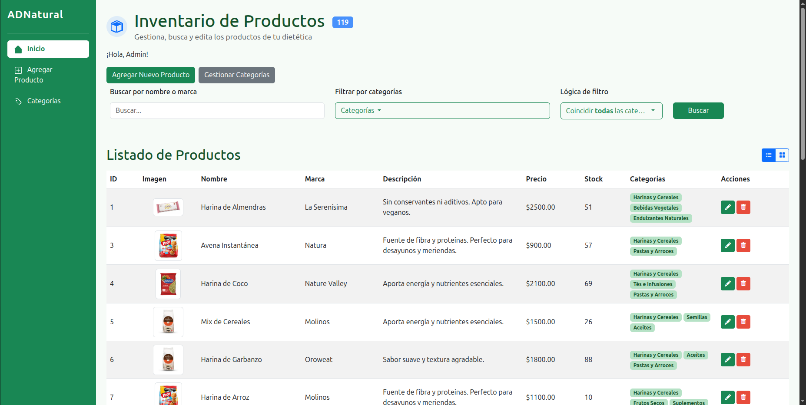
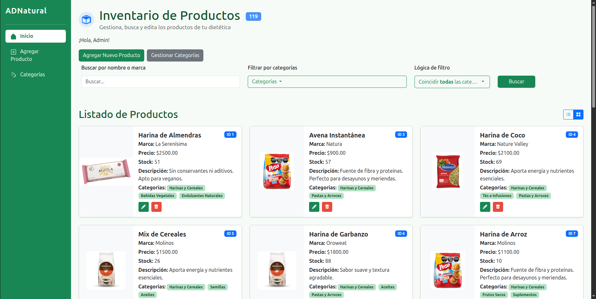
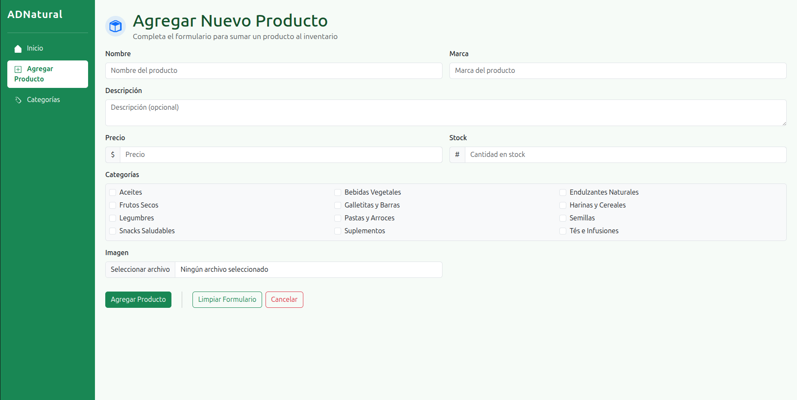
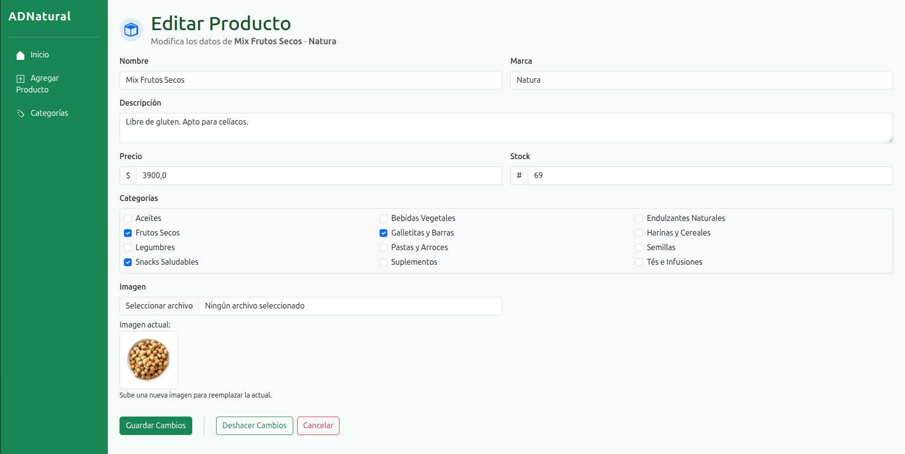
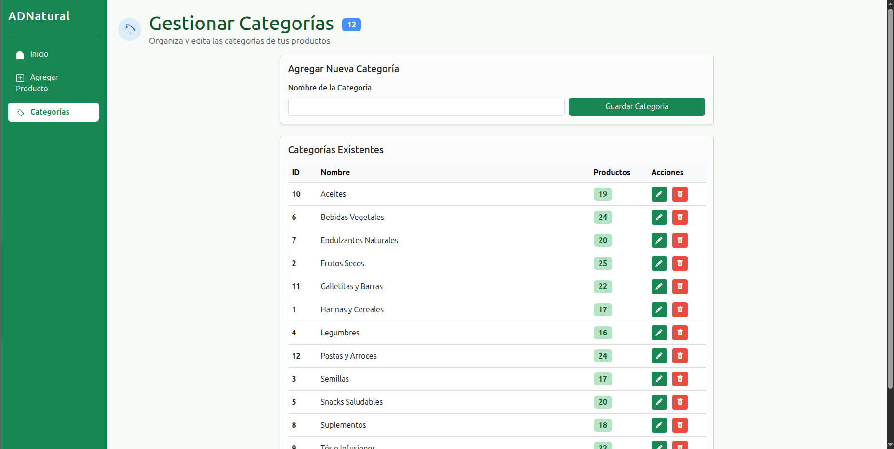

# Sistema de Gestión de Stock

Esto es una aplicación web de gestión de inventario/stock, orientada a un comercio de tipo dietética. El objetivo principal fue construir un *backend* utilizando *Python* y el *framework* *Flask*.

> **Nota:** El *frontend* incluido en este repositorio fue generado íntegramente por una inteligencia artificial. Su única función es servir como interfaz visual para demostrar el funcionamiento de los *endpoints* del *backend*, que es el foco real de este trabajo.

## Tecnologías Utilizadas

Para el desarrollo de este proyecto usé las siguientes herramientas y librerías:

*   ***Python***: Lenguaje base del proyecto.
*   ***Flask***: *Framework* principal.
*   ***SQLAlchemy***: *ORM* para la interacción con la base de datos.
*   ***SQLite***: Base de datos (archivo local).
*   ***Flask-WTF***: Extensión para el manejo y validación de *forms*.
*   ***Jinja2***: Motor de *templates* para renderizar el *HTML*.


## Detalles de Implementación

Durante el desarrollo me enfoqué en resolver la gestión de productos y sus categorizaciones.

*   **Modelado de Datos**: Se implementó una relación *Many-to-Many* entre la tabla `Producto` y `Categoria`. Esto permite que un producto pertenezca a múltiples categorías simultáneamente.
*   **Validaciones**: Usé *Flask-WTF* para asegurar que los datos ingresados (precios positivos, campos obligatorios) sean correctos antes de tocar la base de datos. Esto fue MUY útil para reducir la cantidad de validaciones manuales en las rutas.
*   **Búsqueda y Filtrado**:  Usé una función de normalización de texto (`normalize_text`) que elimina tildes y caracteres especiales. Gracias a esto, la búsqueda es insensible a mayúsculas y tildes.
*   **Manejo de Archivos**: Se configuró la subida de imágenes asegurando nombres de archivo únicos mediante la librería `uuid` y `secure_filename` para evitar problemas de seguridad o colisiones de nombres.


## Capturas de pantalla







## Estructura del Proyecto


*   `app.py`: Contiene la configuración de la *app*, los modelos de la *DB*, las rutas y la lógica.
*   `create_categories.py`: *Script* auxiliar que usé para llenar la base de datos con categorías iniciales.
*   `templates/`: Para el HTML.
*   `static/uploads/`: Directorio donde se almacenan las imágenes subidas.
*   `requirements.txt`: Lista de dependencias necesarias.
*   `inventario.db`: Archivo de la base de datos *SQLite* (se genera al ejecutar la aplicación).

## Instrucciones de Ejecución

Para correr el proyecto localmente:

1.  **Configuración del entorno:**
    ```bash
    python -m venv venv
    source venv/bin/activate  # O venv\Scripts\activate en Windows
    pip install -r requirements.txt
    ```
2.  Inicializar la base de datos y ejecutar el servidor:
    ```bash
    python app.py
    ```
3.  Acceder a `http://127.0.0.1:5000/`.


